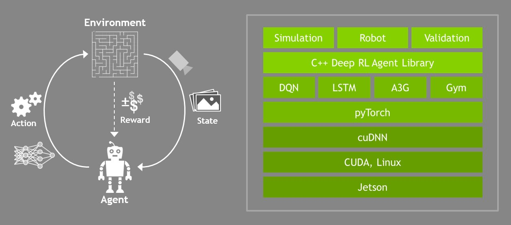

# Deep RL Arm Manipulation

This project is based on the Nvidia open source project "jetson-reinforcement" developed by [Dustin Franklin](https://github.com/dusty-nv).
The goal of the project is to create a DQN agent and define reward functions to teach a robotic arm to carry out two primary objectives:

1. Have any part of the robot arm touch the object of interest, with at least a 90% accuracy.
2. Have only the gripper base of the robot arm touch the object, with at least a 80% accuracy.

## Building from Source (Nvidia Jetson TX2)

Run the following commands from terminal to build the project from source:

``` bash
$ sudo apt-get install cmake
$ git clone https://github.com/fouliex/DeepRLArmManipulation.git
$ cd DeepRLArmManipulation
$ git submodule update --init
$ mkdir build
$ cd build
$ cmake ../
$ make
```

During the `cmake` step, Torch will be installed so it can take awhile. It will download packages and ask you for your `sudo` password during the install.

## C++ API
To successfully leverage deep learning technology in robots, one need to move to a library format that integrate with robotivs and simulators.
In addition, robots require real-time responses to changes in their environments so computation performance matters.
Therefore the API provides an interface to the Python code written with Pytorch,but the wrappers use Python's low level C
to pass memory objects between the user's application and Torch without extra copies. By using a complied language(C/C++) instead of an interpreted one,
performance is improved and speeded up even more when GPU acceleration is leveraged.

### API stack for Deep Reinforcement Learning


API Stack for Deel RL is from Nvidia [repo](https://github.com/dusty-nv/jetson-reinforcement)

## Arm Plugin

### The Gazebo Arm Plugin 
The robotic arm model found in the Gazebo world calls upon a gazebo plugin called `ArmPlugin`. This plugin is responsible
 for creating the Deep Q-Network(DQN) agent and training it to learn to touch the prop.
 
 The gazebo plugin shared `libgazeboArmPlugin.so` a object file that attached to the robot model in the Gazebo world. That
 object file is responsible for integrating the simulation environment with the Reinforcement Learning(RL) agent. The  plugin is defined
 int the `ArmPlugin.cpp` file located in the [gazebo](./gazebo) folder.
 
### The Arm Plugin Base functions

### The Arm Plugin Source Code
The `ArmPlugin.cpp` take advantage of the **C++ API**. This plugin creates specific functions for the class ArmPlugin defined in
`ArmPlugin.h`.

###### ArmPlugin::Load()
This function is responsible for creating and initializing nodes that subscribe to two specific topics, one for the camera
and one for the contact sensor for the object.

###### ArmPlugin::onCameraMsg()
This function is the calllback function for the camera subscriber. It takes the message from the camera topic, extracts
the image and saves it. This is then passed to the DQN.

###### ArmPlugin::onCollisionMsg()
This function is the callback function for the object's contact sensor. It is used to test whether the contact sensor,
 called `my_contact`, defined for the object in Gazebo world, observes a collision with another element/model or not.
 
###### ArmPlugin:createAgent()
This function serves to create and initialize the agent.Various parameters that are passed to the `Create()` function for
the agent are defined at the top of the file such as:

```cpp
#define INPUT_WIDTH   512
#define INPUT_HEIGHT  512
#define OPTIMIZER "None"
#define LEARNING_RATE 0.0f
#define REPLAY_MEMORY 10000
#define BATCH_SIZE 8
#define USE_LSTM false
#define LSTM_SIZE 32
```
###### ArmPlugin:updateAgent()
This function receives the action value from the DQN and decides to take that action.
For every frame that the camera receives, the agent needs to take an appropriate action. Because the DQN agent is discrete, the network
selects one output for every frame. This output which is the action value can then be mapped to a specific action thus controlling the arm joints.

There are two possible ways to control the arm joints:
* Velocity Control
* Position Control

For both of these types of control, one can increase or decrease either the joint velocity or the joint position, by a small delta value.

In this project, Talk more here...

###### ArmPlugin::OnUpdate()
This function is utilized to issue rewards and train the DQN. It is called upon at every simulation iteration and can be used to update the robot joints,
and issue both rewards based on the desired goal:
* End of Episode(EOE)
* Interim

At EOE, various parameters for the API and the plugin are reset, and the current accuracy of the agent performing the appropriate task is displayed on the terminal.

## Arm Plugin Rewards
The reward information are defined in the ArmPlugin::OnUpdate() function.The arms joints are updated using position control and for each
joint there are two action which is to increase or decrease the joint position.
### Reward Win and Reward loss
The parameter  `REWARD_WIN` is set to 0.125 for the first objective and 0.1 for the second objective and `REWARD_LOST` is
set to the opposite values for the objectives(-0.125 and -0.1). In addition if the gripper hit the ground a `10 * REWARD_LOST` is set and the episode end.
Furthermore, any collision ends the episode.

### Interim Rewards
The interim rewards are base on the distance goal $\Delta$ betweem the cycling prop and the gripper. A `REWARD_WIN`
is recorded if a positive weighted average is derived otherwise a `REWARD_LOST * dictance to goal` is recorded.

For the second objective, addition `REWARD_LOST` is added to penalize no movement if the absolute average goal delta is 
less than 0.001 for the gripper base.


## Hyperparameters

*`INPUT_WIDTH` and `INPUT_HEIGHT`  are set to 64.
* `OPTIMIZER` is set to Adam. it performs better then RMSProp.
* `LEARNING_RATE` is set to 0.1 for the first objective and 0.01 for the second objective
* `REPLAY_MEMORY` is set to 10000 for the first objective and 2000 for the second objective.
* `BATCH_SIZE` is set to 512
* `USE_LSTM` is set to true
* `LSTM_SIZE` is set to 256

## Result

## Future Work


## Project Environment

To get started with the project environment, run the following:

``` bash
$ cd RoboND-DeepRL-Project/build/aarch64/bin
$ chmod u+x gazebo-arm.sh
$ ./gazebo-arm.sh
```


The plugins which hook the learning into the simulation are located in the `gazebo/` directory of the repo. The RL agent and the reward functions are to be defined in [`ArmPlugin.cpp`](gazebo/ArmPlugin.cpp).
